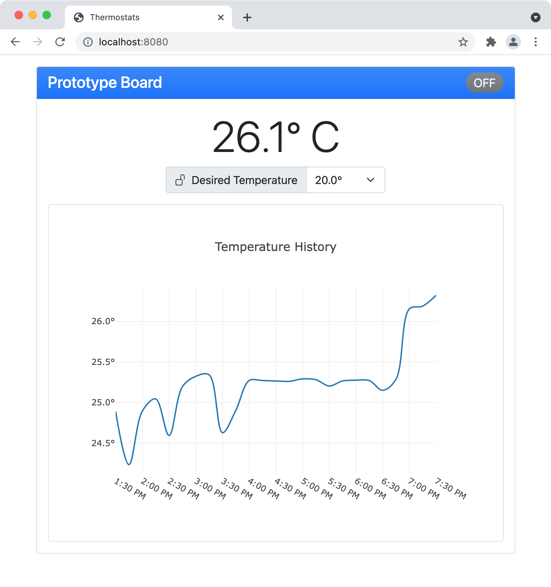

# Thermostat Server

A [server component](./src/main/java/edu/snhu/robert/swanke/thermostat) and [web interface](./src/main/resources/META-INF/resources) for a [network thermostat](https://github.com/robert-swanke-snhu/thermostat).

Maintains connections to configured thermostats and provides a REST API to clients.

Collects periodic temperature data for reporting.

